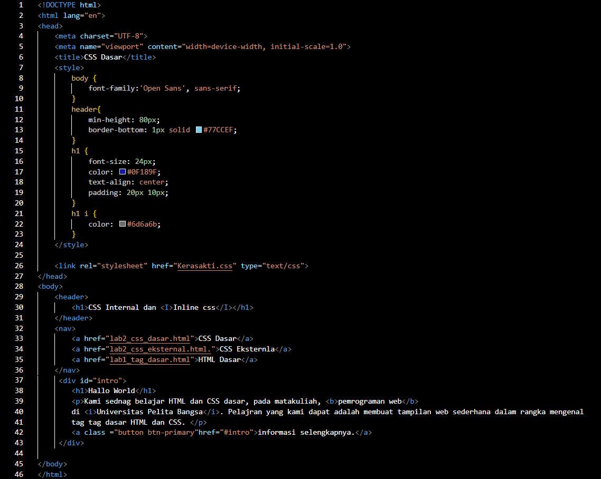

# Pratikum 2 - CSS Dasar
### NAMA : Raihan Ardiansyah
### NIM : 312410396
### KELAS : TI.24.A3

## 📍LANGKAH - LANGKAH PENGERJAAN

### 1. MEMBUAT FILE DASAR HTML.

```html
<!DOCTYPE html>
<html>
  <head>
    <title>Lab 1 – HTML Dasar</title>
  </head>
  <body>
    <!-- Konten HTML akan ditambahkan di sini -->
  </body>
</html>
```

📸 **SCREENSHOOT VSCODE & BROWSER**



<br>


 **MENDEKLARASIKAN CSS INTERNAL**
 
Kemudian tambahkan deklarasi CSS internal seperti berikut pada bagian head dokumen.


<br>


  **MENAMBAHKAN INLINE CSS**
  
Kemudian tambahkan deklarasi inline CSS


Simpan kembali dan refresh kembali browser untuk melihat perubahannya.


 **MEMBUAT CSS EKSTERNAL**

 Buatlah file baru dengan nama style_eksternal.css kemudian buatlah deklarasi CSS seperti berikut.

 

 Kemudian tambahkan tag link untuk merujuk file css yang sudah dibuat pada bagian head


Selanjutnya refresh kembali browser untuk melihat perubahannya.


**MENAMBAHKAN CSS SELECTOR**

Selanjutnya menambahkan CSS Selector menggunakan ID dan Class Selector. Pada file style_eksternal.css, tambahkan kode berikut.


Kemudian simpan kembali dan refresh browser untuk melihat perubahannya.


**JAWABAN UNTUK PERTANYANNYA**

1. Untuk soal pertama, kita bisa melakukan eksperimen dengan menambahkan properti CSS baik secara internal, eksternal, maupun inline. Misalnya dengan menambahkan warna teks, ukuran font, latar belakang, atau perataan teks. Dengan begitu, tampilan elemen HTML akan berubah sesuai properti yang kita tambahkan.

2. Pada soal kedua, perbedaan antara deklarasi h1 {…} dengan #intro h1 {…} ada pada cakupan selektornya. Selektor h1 berlaku untuk semua elemen heading h1 yang ada di halaman web, sedangkan #intro h1 hanya berlaku khusus untuk elemen h1 yang berada di dalam elemen dengan id="intro". Dengan kata lain, #intro h1 lebih spesifik dibandingkan h1.

3. Untuk soal ketiga, apabila terdapat deklarasi CSS yang sama dalam internal, eksternal, dan inline, maka yang ditampilkan oleh browser adalah CSS dengan prioritas tertinggi. Urutannya adalah inline CSS yang memiliki prioritas tertinggi, diikuti oleh internal CSS, dan terakhir eksternal CSS. Jadi meskipun pada internal atau eksternal sudah diatur warna teks biru, jika inline CSS menetapkan warna merah, maka teks akan tetap berwarna merah.

4. Sedangkan pada soal keempat, jika sebuah elemen HTML memiliki deklarasi CSS melalui ID dan class sekaligus, maka yang akan ditampilkan adalah deklarasi dengan spesifisitas yang lebih tinggi, yaitu ID. Dengan demikian, jika sebuah paragraf diberi ID dan class lalu keduanya memiliki aturan CSS yang berbeda, maka aturan CSS dari ID yang akan diterapkan oleh browser.
